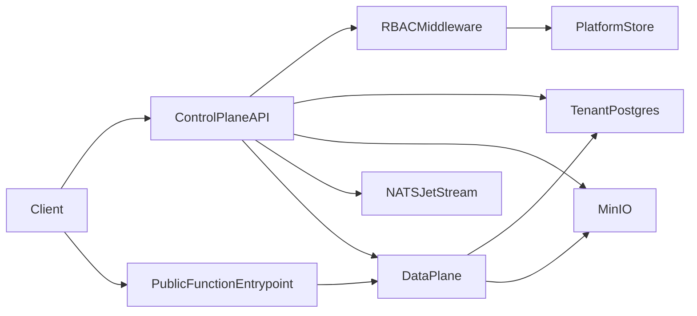

# Nanas

Nanas is an open-source backend platform MVP for multi-tenant projects, tenant PostgreSQL databases, S3-compatible object storage, versioned functions, triggers, realtime delivery, and basic observability.

The repository contains two Go services:

- **Control plane API** (`cmd/api`): authentication, project provisioning, tenant database access, object storage, function versions, deployments, triggers, public function entrypoints, platform administration, logs, and governance controls.
- **Dataplane** (`cmd/dataplane`): an MVP deploy/invoke service with a bounded sandbox stub. It records deployment metadata and executes a lightweight runtime smoke path for Node.js or Go.

## Architecture



## Quick Start

Requirements:

- Docker and Docker Compose
- Go 1.24+ for local development

Start the local stack:

```bash
docker compose up -d
```

Check service health:

- `GET http://localhost:8080/healthz` confirms the API process is alive.
- `GET http://localhost:8080/readyz` confirms the platform PostgreSQL database and MinIO object storage are reachable. If either dependency is unavailable, the API returns a structured Problem response such as `INTERNAL_ERROR` or `STORAGE_UNAVAILABLE`.

Once the stack is up, the bundled web UI is reachable at `http://localhost:8080/`. The single binary serves both the API and the React SPA from the same origin.

Documentation overview and links: [docs/README.md](docs/README.md). Follow the full onboarding flow in [docs/MVP_RUNBOOK.md](docs/MVP_RUNBOOK.md). Detailed endpoint reference lives in [docs/API.md](docs/API.md). The MVP 2 roadmap is in [docs/MVP2_PLAN.md](docs/MVP2_PLAN.md).

## Web UI

The control-plane dashboard is a single-page React + TypeScript app under [`web/`](web/). It is built and embedded into the Go binary by the `Dockerfile` multistage build, so production deployments stay one container. For local SPA development (hot reload, types regeneration from `openapi.yaml`):

```bash
cd web
pnpm install
pnpm gen:api      # regenerate src/api/types.ts from ../openapi.yaml
pnpm dev          # http://localhost:5173, proxies API to :8080
```

See [`web/README.md`](web/README.md) for the full developer guide.

## Roles

Nanas uses two RBAC dimensions.

### Platform roles (`users.platform_role`)

| Role | Capabilities |
| --- | --- |
| `super_admin` | Full platform control, including assigning platform roles. The first registered user is auto-promoted. |
| `staff` | List users, list projects across owners, disable or enable projects. |
| `user` | Default role for normal end users; no admin endpoints. |

Platform admin endpoints live under `/admin/...` and require platform-level roles.

### Project roles (`project_permissions.role` and API key role)

| Role | Capabilities |
| --- | --- |
| `admin` | Manage members, API keys, settings, plus all developer actions. |
| `developer` | Create functions, deploy versions, run controlled DDL/DML, configure triggers and entrypoints. |
| `viewer` | Read project metadata, logs, DLQ, and entrypoint configuration. |

Project owners are implicitly `admin`. API keys carry a role per key.

## Public Function Entrypoint

External callers can reach a deployed function through a stable URL. Configure the entrypoint with `POST /v1/projects/:pid/functions/:fid/entrypoint` and choose one of three auth modes:

- `public`: open access (use carefully).
- `signed`: requires `X-Entrypoint-Token` header (or `?token=` query) matching a server-generated secret.
- `project_key`: requires `Authorization: Bearer sk_...` for the project.

Once configured, callers invoke `POST /fn/{project_slug}/{function_slug}` with an optional JSON body. Slugs are generated automatically from the project and function names. The control plane forwards the call to the dataplane with tenant database and object storage environment values injected.

## Key Environment Variables

| Variable | Purpose |
| --- | --- |
| `DATABASE_URL` | PostgreSQL connection string for platform metadata. |
| Schema migrations | Embedded under [`internal/migrate/sql`](internal/migrate/sql) as [golang-migrate](https://github.com/golang-migrate/migrate) `*.up.sql` / `*.down.sql` pairs. Applied at API startup; ledger table `platform_schema_migrations`. Older dev DBs may still have legacy `schema_migrations(filename)` — safe to drop manually. |
| `TENANT_DB_SUPER_URL` | Optional PostgreSQL superuser connection string for tenant `CREATE DATABASE`. If unset, `DATABASE_URL` is used and must have `CREATEDB` privileges. |
| `TENANT_DB_HOST` | Host and port used when building tenant database URLs for API and dataplane access. |
| `MINIO_ENDPOINT`, `MINIO_ACCESS_KEY`, `MINIO_SECRET_KEY`, `MINIO_USE_SSL` | S3-compatible object storage settings. |
| `MINIO_WEBHOOK_SECRET` | Secret expected in `X-Minio-Webhook-Secret` for object event webhooks. |
| `DATA_PLANE_URL` | Base URL for the dataplane service. The Compose default is `http://dataplane:8090`. |
| `NATS_URL` | NATS JetStream URL for trigger dispatch. Leave empty to disable event bus integration. |
| `TENANT_SECRET_ENCRYPTION_KEY` | 32-byte raw or base64 key used for tenant secret envelope encryption. |
| `LOCALES_DIR` | Directory containing `en.yaml` and optional `id.yaml` locale files. The Docker image uses `/app/locales`. |
| `PUBLIC_API_BASE_URL` | Base URL used to build public entrypoint URLs reported in API responses. |

Project provisioning creates one tenant database and one MinIO bucket per project. If tenant database creation or MinIO bucket creation fails, `GET /v1/projects/:pid` exposes the failure in `provision_error`.

## API Errors and i18n

The API returns structured Problem JSON for failures. Each error includes stable codes and bilingual messages:

```json
{
  "type": "about:blank",
  "code": "VALIDATION_ERROR",
  "message": { "id": "Validasi gagal.", "en": "Validation failed." },
  "message_preferred": "Validation failed."
}
```

`message_preferred` follows the `Accept-Language` header. The full error catalog is documented in [docs/API.md](docs/API.md). Documentation remains in standard English; Indonesian strings are kept in locale files and inline API examples only.

## Local Development

```bash
go build ./...
go test ./...
```

Run integration smoke tests against a running stack:

```bash
go test -tags=integration ./integration/...
```

Set `NANAS_BASE_URL` if the API is not running at `http://localhost:8080`.

## Deployment

The default Docker Compose file (`docker-compose.yml`) starts:

- PostgreSQL 16 (platform metadata and tenant databases).
- MinIO (object storage).
- NATS JetStream (trigger dispatch).
- The Nanas API and dataplane services.

For production deployments, replace MinIO with managed S3, point `DATABASE_URL` at managed PostgreSQL with `CREATEDB` privileges or set `TENANT_DB_SUPER_URL`, expose `/admin` only to operator IP ranges, and provide a 32-byte `TENANT_SECRET_ENCRYPTION_KEY`.

## License

Nanas is distributed under the [MIT License](LICENSE).
